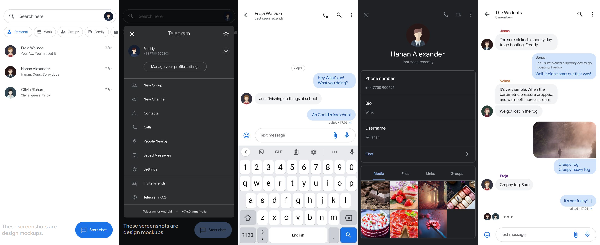

# Radiogram
MD2 Telegram client.

The client has a nice design inspired by the design of Google's apps. It's supposed to be consistent with the rest of the OS.

Radiogram is built with Kotlin and ktd.
